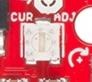

# Inspiration

[DIY Silent Programmable Coffee Grinder](https://www.theverge.com/circuitbreaker/2017/12/20/16798042/diy-silent-programmable-coffee-grinder)

[Really nice Hario motorized walkthrough](https://imgur.com/a/Xm1oq)

[Motorizing a hand-cranked coffee grinder - Youtube](https://www.youtube.com/watch?v=ALXiloyym0M)


# Electronics
## Easy driver

[Easy Driver hook upguide - Sparkfun](https://learn.sparkfun.com/tutorials/easy-driver-hook-up-guide/all)

For a 6-wire motor, you will need to determine which of three the wires go together for one coil. Pick one wire, and test this against all other wires. Two wires should show some resistance between them and the first wire picked, while the other three will show no connection at all. Once the three wires for one coil have been determined, find two of the three that show the highest resistance between them. These will be your two coil wires. Repeat for the second group of three wires.

Once you have determined the coil wire pairs, you will need to attach them to the Easy Driver. The first coil pair should be plugged into Coil A+ and Coil A-, while the second coil pair plugs into Coil B+ and Coil B-. There is no polarity on the coils, so you don’t need to worry about plugging in a coil backwards on the board.

The potentiometer on board is included to allow users the ability to select the max current provided to the motor. It ranges from 150mA to 750mA. This will require you to be aware what current range your motor can handle -- check the motor’s data sheet for the current settings.



If you can’t find this information, have no fear – you can still find the proper setting for the potentiometer. First, set it to the lowest setting of the potentiometer. Keep in mind that the potentiometer is delicate, so be careful to not force the potentiometer past the mechanical stops when turning it. Once you have the motor being driven at a slow, yet steady speed, slowly turn the potentiometer and pay attention to the motor’s behavior. You should find a sweet spot where the motor doesn’t skip or jerk between steps.

## Motor wiring

Resistance between wires. Black stepper motors with 6 wires.

|              | Stripe Green | Green | White | Stripe Red | Red  | Black |
|--------------|--------------|-------|-------|------------|------|-------|
| Stripe Green | -            | 27.8  | 16.7  | 0          | 0    | 0     |
| Green        |              | -     | 16.7  | 0          | 0    | 0     |
| White        |              |       | -     | 0          | 0    | 0     |
| Stripe Red   |              |       |       | -          | 28.2 | 15    |
| Red          |              |       |       |            | -    | 15    |
| Black        |              |       |       |            |      | -     |

| Group 1               | Group 2             |
| --------------------- | ------------------- |
| White                 | Black               |
| (Coil A) Stripe Green | (Coil B)Stripe Red  |
| (Coil A) Green        | (Coil B) Red        |


## Power supply


[Transform ATX into lab power supply](https://www.instructables.com/id/Converting-a-computer-ATX-power-supply-to-a-really/)

# Powering the Arduino

You can draw power from the 5v and VIN pins on the arduino. VIN is the completely unaltered input power before the regulator (it will be useless if regulated 5v is supplied directly). Outputting power is what the 5v pin is intended to be used for, not as a power input.

From the arduino website:

`5V. This pin outputs a regulated 5V from the regulator on the board. The board can be supplied with power either from the DC power jack (7 - 12V), the USB connector (5V), or the VIN pin of the board (7-12V). Supplying voltage via the 5V or 3.3V pins bypasses the regulator, and can damage your board. We don't advise it.`

Yet, provided that you do not exceed 5.5 volts on the +5v pin, you can absolutely use it to supply the arduino. You bear the responsibility of ensuring that you do not exceed 6v though.

Source: [StackExchange](https://arduino.stackexchange.com/a/4460)


# Physical Parts
## Hario adapter
### Thingverse
[Drill bit adapter](https://www.thingiverse.com/thing:869573)

[Drill bit adapter](https://www.thingiverse.com/thing:1002724)

[NEMA 23 mount with bean feed](https://www.thingiverse.com/thing:1621556)

## Measurements
### Hario
90mm diameter on top
2mm thickness

### Motor
gear
25 teeth
13mm diameter

base
57mm square
5mm hole
2mm from lateral to edge of hole


# Code

Simple working sample.
```C
void setup() {               
  pinMode(8, OUTPUT);
  pinMode(9, OUTPUT);
  digitalWrite(8, LOW);
  digitalWrite(9, LOW);
}

void loop() {
  digitalWrite(9, HIGH);
  delay(1);         
  digitalWrite(9, LOW);
  delay(1);         
}
```

Source: [schmalzhaus.com](https://www.schmalzhaus.com/EasyDriver/Examples/EasyDriverExamples.html)